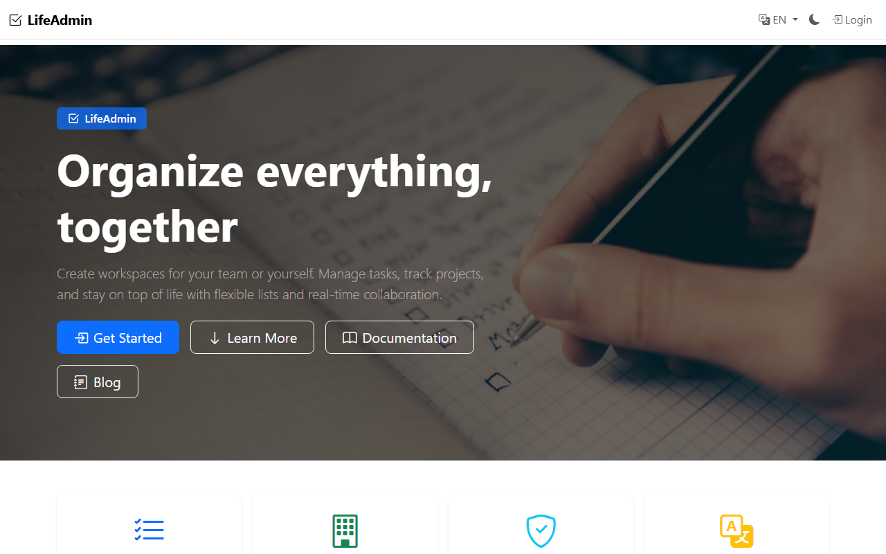
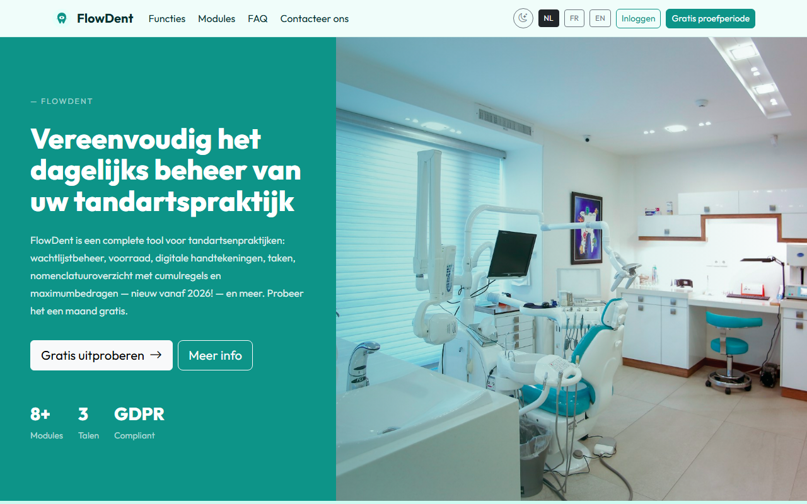
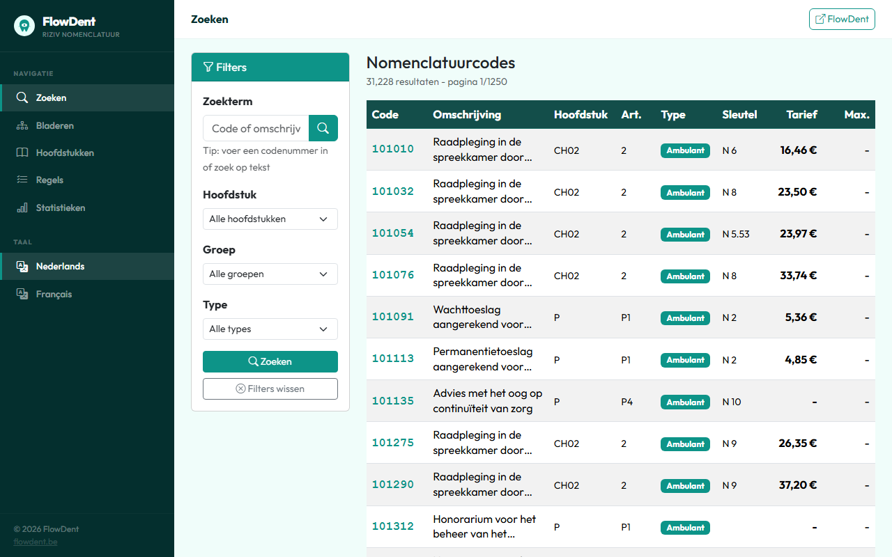
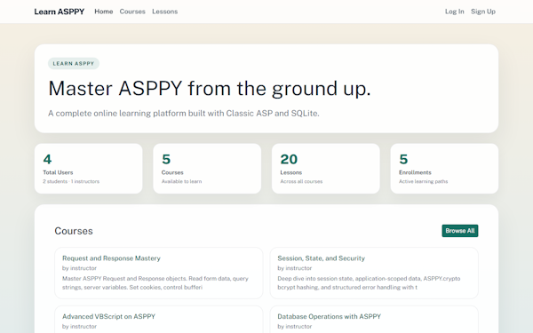

# ASPPY - Classic ASP/VBScript Runtime for Python

**Run your legacy Classic ASP pages on modern Python infrastructure - no IIS required.**

ASPPY is a Python-based runtime that executes Classic ASP (VBScript) pages on Windows, Linux, and macOS. It implements the full Classic ASP object model (`Request`, `Response`, `Session`, `Application`, `Server`) alongside broad VBScript built-in coverage, so most legacy ASP applications just work.

And ASPPY is not just a framework on paper - it powers **real, live websites in production today**, serving real users every day. [See them below.](#built-with-asppy--real-websites-real-users)

---

## Why ASPPY?

Classic ASP applications represent decades of business logic. Rewriting them is expensive and risky. ASPPY lets you **keep your existing `.asp` files** and serve them through a lightweight Python HTTP server - no COM, no Windows dependency, no IIS license. Linux typically runs Python 10–30% faster than Windows, increasing the performance advantage of modern frameworks like ASPPY over Classic ASP/VBScript on IIS.

---

## Radically Simple. By Design.

While other frameworks pile on tooling, ASPPY strips it away. This is what sets it apart:

### No build step. Ever.
No `npm install`. No bundlers. No transpilers. No `.ps1` setup scripts. No dependency hell. You edit an `.asp` file, you hit refresh, it's live. **Deployment is a file copy.**

### The entire runtime is under 700 KB - and human-readable
Not 700 MB. **KB.** 39 plain Python files (~150 KB zipped) that you can open, read, and understand. No black box, no vendor magic. If you want to know how something works, you just read the source - all of it fits in your head.

### Compiled, not interpreted line-by-line
ASPPY runs on Python, which **compiles code to bytecode** before execution. Your ASP pages aren't re-scanned as raw text on every hit.

### Compiled ASP pages are cached - zero config, auto-invalidating
Each `.asp` page is parsed and compiled **once**, then served from an in-memory cache. Subsequent requests skip straight to execution - no re-parsing, no wasted cycles. And it's **completely automatic**: nothing to enable, nothing to configure. Edit any `.asp` file - includes too - and ASPPY detects the change and recompiles on the next request. No restart, no cache-busting, ever.

### Performance comparable to IIS
Real-world throughput on par with Classic ASP under IIS - and on Linux, where Python typically runs 10–30% faster than on Windows, ASPPY pulls ahead. Without the Windows Server license.

### No giant executables to drag around
No multi-hundred-MB runtime installers, no self-contained EXE blobs, no Docker images you have to babysit. Python + a folder of source files. That's the whole deployment story.

### Runs happily on a nano VPS
**512 MB RAM, 1 vCPU** is enough to serve production traffic. No JVM warm-up, no node_modules eating your disk, no memory-hungry app server - hosting costs measured in single-digit euros per month.

---

## Built for the AI Era - The Perfect Match for Vibe Coding

ASPPY is a dream partner for AI coding tools like **Claude Code, OpenCode, Codex, Cursor, GitHub Copilot** and all the other important players. Why? Because the entire runtime is a **readable codebase of under 700 KB** - small enough that any modern LLM (even free models, and certainly the well-known cloud models like Opus, Fable, Gemini, GPT, Kimi, GLM, DeepSeek, and friends) can read and understand it **in minutes or less**. No million-line framework to guess about, no hidden magic the AI has to hallucinate around - the model sees the whole picture and gets it right the first time.

For experienced ASP developers, this is a genuinely exciting moment: the skills you've built over decades suddenly pair with the most powerful development tools ever created. Describe the app you want, point your AI agent at ASPPY, and watch it **develop brand-new web apps or re-create existing ASP/VBScript applications in no time - for nearly free**. Legacy modernization, rapid prototyping, full production apps: what used to take weeks of budget and planning now happens in an afternoon. Classic ASP knowledge has never been this valuable - or this much fun to use.

To make vibe coding even easier, the ASPPY repo comes with **two prompt builders** that will be a big help in getting the best out of AI LLM models coding ASP/VBScript for you:

- [MVC Prompt Builder](https://pietercooreman.github.io/ASPPY/prompt-builder.html) - generates the perfect prompt for classic MVC-style ASPPY apps
- [SPA (React + ASPPY) Prompt Builder](https://pietercooreman.github.io/ASPPY/prompt-builder-spa.html) - generates the perfect prompt for single-page apps with a React front-end and an ASPPY back-end

---

## Built with ASPPY — Real Websites, Real Users

ASPPY isn't a proof of concept. It runs **production websites in the wild**, from SaaS products to healthcare tooling to e-learning - built, deployed, and used by real people every day. Here are a few of them:

<table>
  <tr>
    <td width="50%" valign="top">
      <a href="https://lifeadmin.be">
        
      </a>
      <p align="center"><strong><a href="https://lifeadmin.be">lifeadmin.be</a></strong></p>
      <p align="center">A multilingual SaaS platform for organizing life and work: shared workspaces, task management, project tracking, and real-time collaboration - all served by ASPPY.</p>
    </td>
    <td width="50%" valign="top">
      <a href="https://flowdent.be">
        
      </a>
      <p align="center"><strong><a href="https://flowdent.be">flowdent.be</a></strong></p>
      <p align="center">A complete, GDPR-compliant management suite for dental practices: waiting lists, inventory, digital signatures, tasks, and more - trilingual, 8+ modules, running on ASPPY.</p>
    </td>
  </tr>
  <tr>
    <td width="50%" valign="top">
      <a href="https://nomenclatuur.flowdent.be">
        
      </a>
      <p align="center"><strong><a href="https://nomenclatuur.flowdent.be">nomenclatuur.flowdent.be</a></strong></p>
      <p align="center">A searchable database of 31,000+ Belgian RIZIV/INAMI nomenclature codes with filters, tariffs, and cumulation rules - data-heavy pages served fast by ASPPY.</p>
    </td>
    <td width="50%" valign="top">
      <a href="https://learnasppy.quickersite.com">
        
      </a>
      <p align="center"><strong><a href="https://learnasppy.quickersite.com">learnasppy.quickersite.com</a></strong></p>
      <p align="center">A full e-learning platform (courses, lessons, enrollments, user accounts) built with Classic ASP and SQLite on ASPPY - and it teaches you ASPPY itself.</p>
    </td>
  </tr>
</table>

> Running your own site on ASPPY? Open an issue or PR to get it featured here.

---

## Requirements

### Prerequisites

**Python 3.8 or higher must be installed on your server** (Windows, Linux, or macOS).  
Download Python at [https://www.python.org/downloads/](https://www.python.org/downloads/).

> ASPPY is a Python application - Python is required on any machine that runs it, including your production hosting server.

### Python packages

Install the required packages with pip:

```bash
pip install fpdf2 bcrypt pillow pyodbc
```

> Not all packages are needed for every use case - install only what your application uses.

---

## Quick Start

Once Python and the packages above are in place, click `start_www.bat`, or open a new Powershell/CMD terminal:

```bash
python -m ASPPY.server 0.0.0.0 8080 www
```

Point your browser at `http://localhost:8080` and your `.asp` pages are live.

---

## The ASPPY Ecosystem

- https://pietercooreman.github.io/ASPPY/ (ASPPY Docs)
- [MVC Prompt Builder](https://pietercooreman.github.io/ASPPY/prompt-builder.html) - ASPPY prompt builder (for MVC) when using vibe coding tools
- [SPA (React + ASPPY) Prompt Builder](https://pietercooreman.github.io/ASPPY/prompt-builder-spa.html) - ASPPY prompt builder (for SPA) when using vibe coding tools
- https://pietercooreman.github.io/ASPPY/ASPPY_The_Vibe_Coders_Guide.html (ebook for both vibe coding tools and developers)
- https://learnasppy.quickersite.com/ (learn ASPPY coding - very basic site for beginning developers)
- https://pietercooreman.github.io/ASP-Runner/ (run ASP/VBScript code in the browser (WebAssembly) - powered by ASPPY)

---

## The Perfect Prompt ?

Refer AI vibe-coding agents (like OpenCode, Claude Code, Codex agents, Cursor, GitHub Copilot) to the developers.md file, which provides important context and guidelines before starting any development in ASPPY. This reduces development time and cost by 30–40% and significantly improves code quality, even when using free AI coding agents.

The prompt builder comes in two flavours:

- [MVC Prompt Builder](https://pietercooreman.github.io/ASPPY/prompt-builder.html) - ASPPY prompt builder when using vibe coding tools
- [SPA (React + ASPPY) Prompt Builder](https://pietercooreman.github.io/ASPPY/prompt-builder-spa.html) - ASPPY prompt builder when using vibe coding tools

---

## What's Supported

| Area | Coverage |
|------|----------|
| VBScript built-ins (strings, dates, math, arrays) | Near-complete |
| `Request` / `Response` / `Session` / `Application` / `Server` | Near-complete |
| `Scripting.Dictionary` / `Scripting.FileSystemObject` | Supported |
| `ADODB.Connection` / `Recordset` / `Command` / `Stream` | Partial |
| Database backends | SQLite, Access, Excel (read-only), ODBC, PostgreSQL |
| `VBScript.RegExp` | Supported |
| MSXML HTTP & DOM | Partial (security-sandboxed) |
| `CDO.Message` (SMTP) | Partial |
| POP3 / IMAP | Partial |
| `Global.asa` events | Supported |

ASPPY also ships extended helpers beyond classic ASP - JSON encode/decode, ZIP, PDF generation, image processing, and bcrypt password hashing - all accessible from VBScript via the global `ASPPY` object.

---

## Platform Support

Windows · Linux · macOS

---

## Compatibility Notes

ASPPY targets practical app-level compatibility, not byte-for-byte IIS parity. Locale-specific formatting, edge-case type coercion, and COM-level quirks may differ. SQL is executed as-is by the underlying driver - no dialect translation is performed.

If you're migrating a critical application, run your own regression tests against ASPPY alongside IIS before cutting over.

---

## License

See [LICENSE](LICENSE) for details.

---

## Legal Disclaimer

**Disclaimer of Affiliation**

ASPPY is an independent software project developed by Pieter Cooreman.

ASPPY is not affiliated, associated, authorized, endorsed by, or in any way officially connected with Microsoft Corporation, or any of its subsidiaries or its affiliates. The official Microsoft website can be found at https://www.microsoft.com.

The names "Microsoft," "Active Server Pages," "ASP," and "VBScript," as well as related names, marks, emblems, and images, are registered trademarks of Microsoft Corporation. The use of these trademarks within this project is purely for descriptive, identification, and reference purposes to indicate technical compatibility, and does not imply any association with, or endorsement by, the trademark holder.
